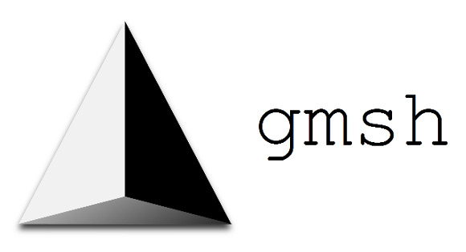

# Gmsh Project



## Описание
Этот проект использует **Gmsh** — мощный инструмент для генерации конечных элементов, построения сеток и работы с геометрией. Здесь вы найдете скрипты, примеры и инструкции по использованию Gmsh для различных задач.

## Возможности
- Создание 2D и 3D сеток
- Импорт и экспорт геометрии в различных форматах
- Настройка параметрических моделей
- Генерация конечных элементов различного порядка
- Автоматическое и адаптивное уплотнение сетки

## Установка
### Установка Gmsh
1. **Скачать и установить** Gmsh с [официального сайта](https://gmsh.info/):
   - Windows: установочный `.exe`
   - Linux: бинарный `.AppImage`
   - macOS: `.dmg` или компиляция из исходников
2. **Проверить установку**:
   ```bash
   gmsh -version
   ```

### Альтернативная установка через Python
Если вы используете Python, можно установить Gmsh как библиотеку:
```bash
pip install gmsh
```

## Установка Streamlit для презентации
Этот проект использует **Streamlit** для визуализации данных и презентации о Gmsh.

### Шаги установки:
1. **Создайте виртуальное окружение (venv) (рекомендуется)**:
   ```bash
   python -m venv venv
   ```
2. **Активируйте виртуальное окружение**:
   ```bash
   source venv/bin/activate  # для Linux/Mac
   venv\Scripts\activate  # для Windows
   ```
3. **Установите Streamlit**:
   ```bash
   pip install streamlit
   ```
4. **Проверьте установку**:
   ```bash
   streamlit hello
   ```
   Если Streamlit запустился в браузере, установка прошла успешно.

### Запуск презентации
После установки Streamlit и активации виртуального окружения запустите презентацию командой:
```bash
streamlit run Tittle.py
```
Где `Tittle.py` — ваш скрипт для презентации.

## Использование
### Генерация сетки
1. **Создайте геометрию в файле `.geo`**, например `example.geo`:
   ```c
   SetFactory("OpenCASCADE");
   Rectangle(1) = {0, 0, 0, 10, 5};
   Mesh 2;
   Save("example.msh");
   ```
2. **Запустите Gmsh для генерации сетки**:
   ```bash
   gmsh example.geo -2 -o example.msh
   ```

### Использование API Gmsh в Python
Пример скрипта на Python для создания сетки:
```python
import gmsh

gmsh.initialize()
gmsh.model.add("square")
factory = gmsh.model.geo
factory.addRectangle(0, 0, 0, 10, 5)
factory.synchronize()
gmsh.model.mesh.generate(2)
gmsh.write("square.msh")
gmsh.finalize()
```
Запуск:
```bash
python script.py
```

## Форматы файлов
- **`.geo`** — входной файл с описанием геометрии.
- **`.msh`** — выходной файл с сеткой (совместим с FEM-пакетами).
- **`.step`**, **`.stl`** — импорт/экспорт CAD-моделей.

## Полезные ресурсы
- [Официальный сайт Gmsh](https://gmsh.info/)
- [Документация](https://gmsh.info/doc/texinfo/gmsh.html)
- [Примеры](https://gitlab.onelab.info/gmsh/gmsh/-/tree/master/tutorials)

## Лицензия
Этот проект распространяется под лицензией **MIT**.

